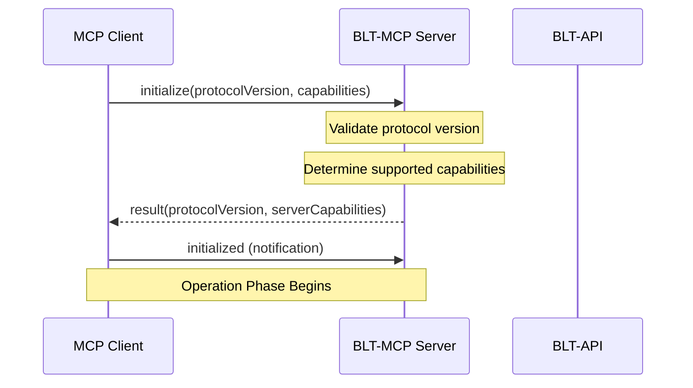
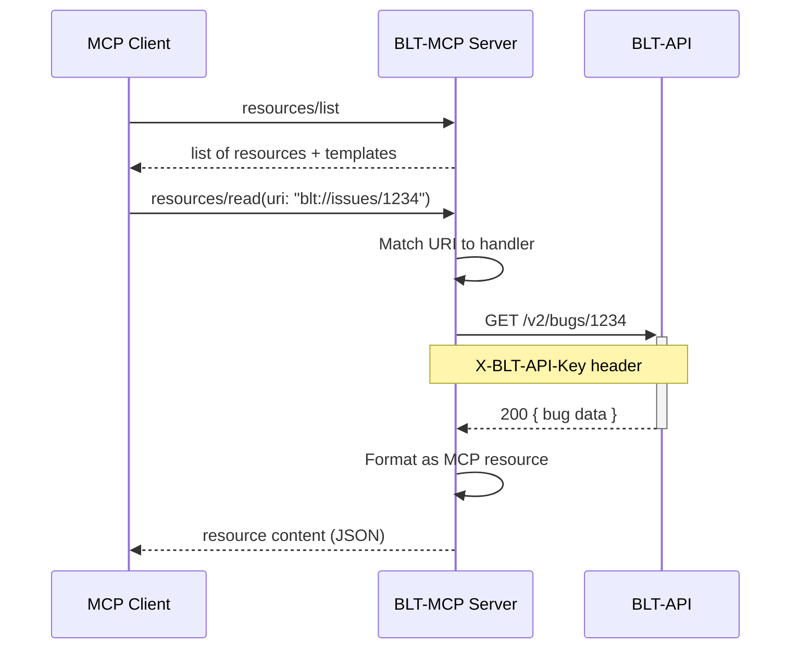
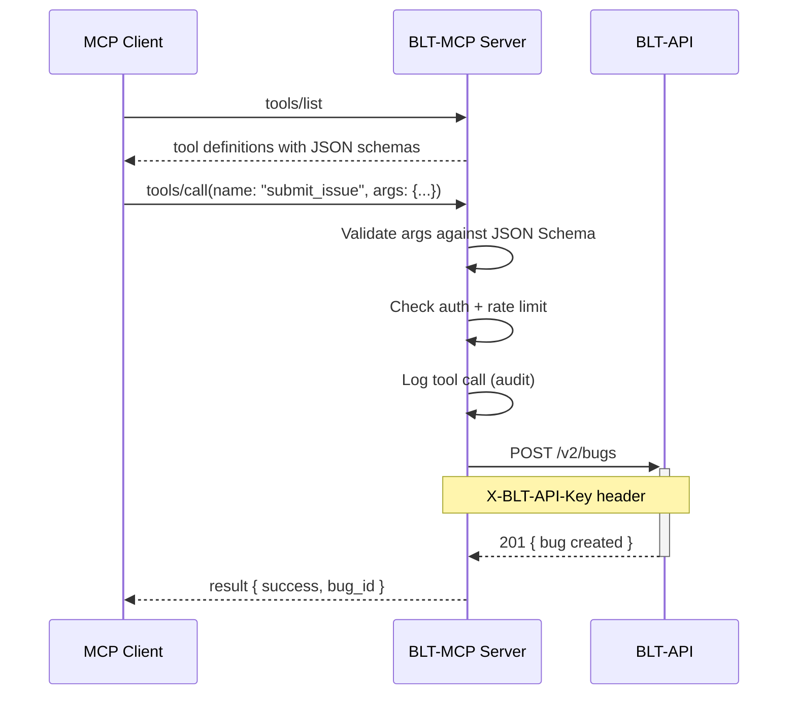
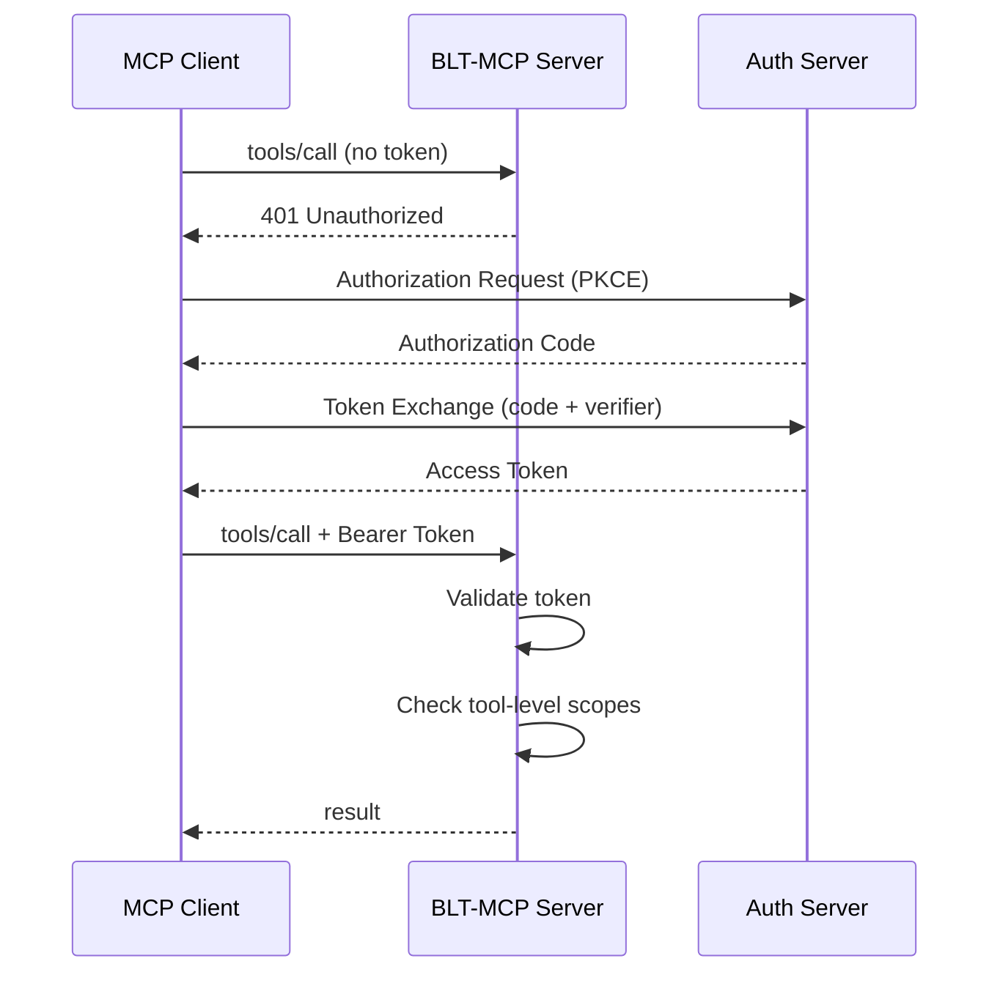
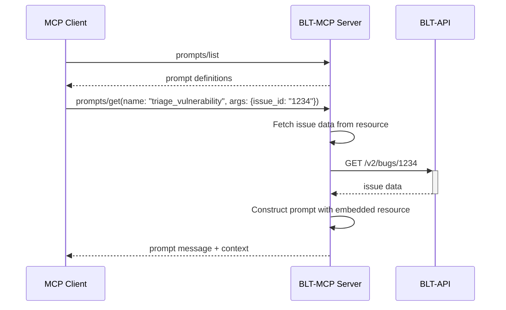
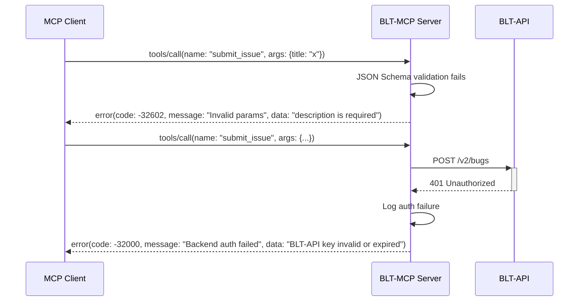
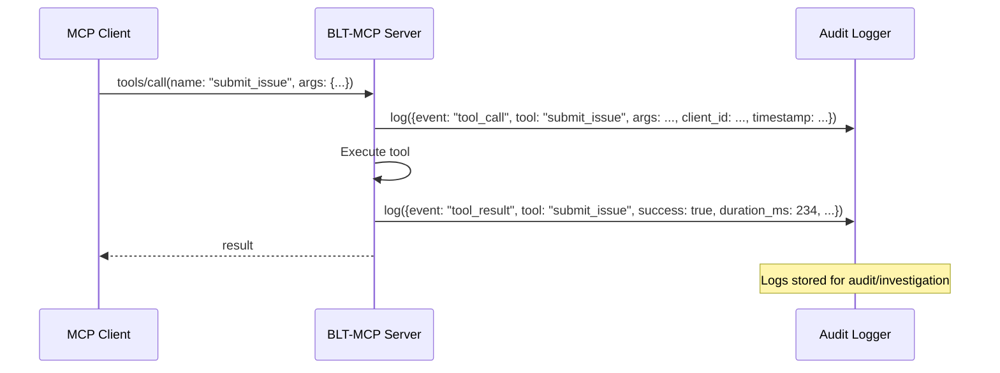
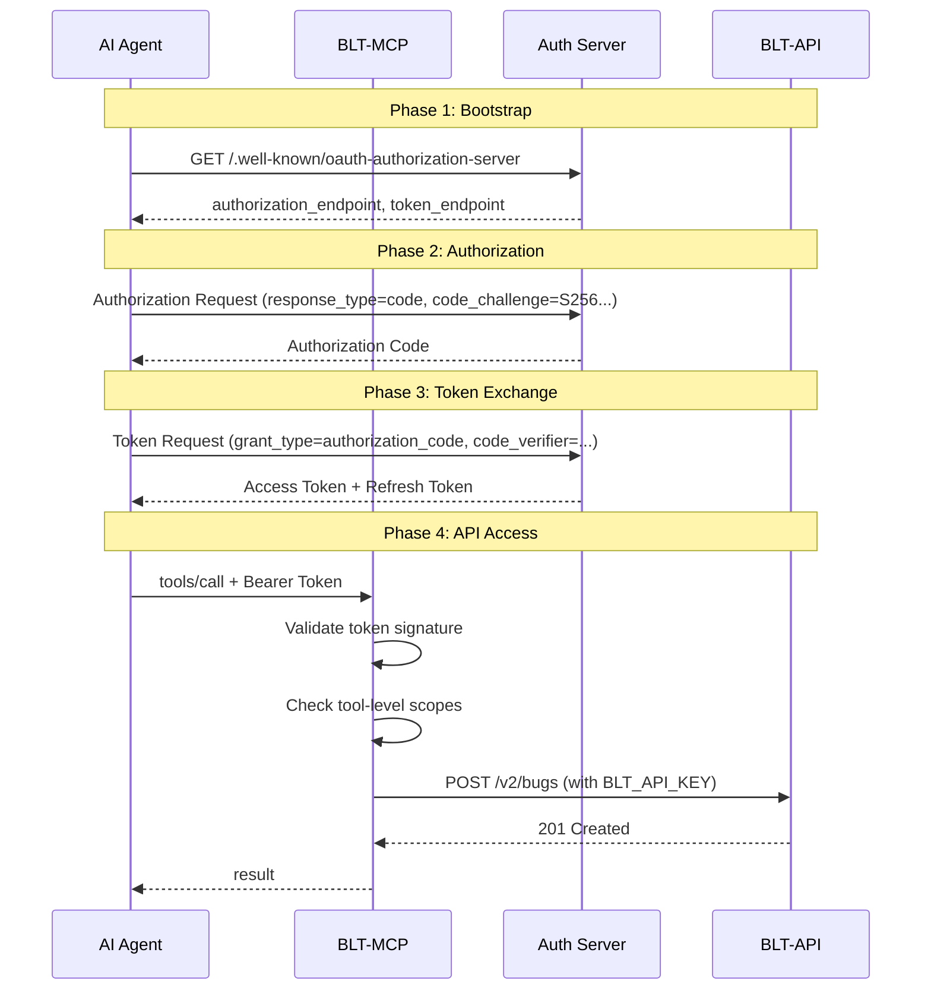

# BLT-MCP Architecture

> **Document Version:** 1.0
> **Status:** Draft
> **Date:** 2026-06-26

---

## High Level Architecture

BLT-MCP follows a layered architecture pattern where the MCP server sits between AI agent clients and the BLT backend services. It implements the Model Context Protocol (MCP) specification (2025-11-25) to provide standardized access to the BLT ecosystem.

```
+---------------------------------------------------------------------+
|                        BLT-MCP Architecture                         |
|                                                                      |
|   +-------------------+     +-------------------+                   |
|   |   MCP Clients     |     |   External AI     |                   |
|   |                   |     |   Platforms       |                   |
|   | - Claude Desktop  |     | - ChatGPT         |                   |
|   | - VS Code Ext     |     | - Custom Agents   |                   |
|   | - Cline           |     | - IDE Plugins     |                   |
|   +--------+----------+     +--------+----------+                   |
|            |                         |                               |
|            +------------+------------+                               |
|                         |                                            |
|           JSON-RPC 2.0 / stdio or HTTP/SSE                          |
|                         |                                            |
|            +------------v------------+                               |
|            |     BLT-MCP Server      |                               |
|            |   (Python/FastMCP)      |                               |
|            |                         |                               |
|            |  +-------------------+  |                               |
|            |  | Transport Layer   |  |                               |
|            |  | stdio | HTTP/SSE  |  |                               |
|            |  +-------------------+  |                               |
|            |                         |                               |
|            |  +-------------------+  |                               |
|            |  | Protocol Layer    |  |                               |
|            |  | JSON-RPC 2.0     |  |                               |
|            |  | Lifecycle Mgmt   |  |                               |
|            |  | Capability Neg.  |  |                               |
|            |  +-------------------+  |                               |
|            |                         |                               |
|            |  +-------------------+  |                               |
|            |  | Resource Layer    |  |  blt:// URIs                 |
|            |  | - issues         |  |                               |
|            |  | - contributors   |  |                               |
|            |  | - repos          |  |                               |
|            |  | - leaderboards   |  |                               |
|            |  | - rewards        |  |                               |
|            |  +-------------------+  |                               |
|            |                         |                               |
|            |  +-------------------+  |                               |
|            |  | Tool Layer        |  |                               |
|            |  | - submit_issue   |  |                               |
|            |  | - award_bacon    |  |                               |
|            |  | - update_status  |  |                               |
|            |  | - add_comment    |  |                               |
|            |  +-------------------+  |                               |
|            |                         |                               |
|            |  +-------------------+  |                               |
|            |  | Prompt Layer      |  |                               |
|            |  | - triage_vuln    |  |                               |
|            |  | - plan_remediate |  |                               |
|            |  | - review_contrib |  |                               |
|            |  +-------------------+  |                               |
|            |                         |                               |
|            |  +-------------------+  |                               |
|            |  | Guardrails        |  |                               |
|            |  | Auth | Rate Limit |  |                               |
|            |  | Audit | Validate  |  |                               |
|            |  +-------------------+  |                               |
|            +-------------------------+                               |
|                         |                                            |
|            +------------v------------+                               |
|            |     BLT Backend         |                               |
|            |                         |                               |
|            |  +-------------------+  |                               |
|            |  | BLT-API (REST)   |  |                               |
|            |  | Cloudflare Wrkr  |  |                               |
|            |  +-------------------+  |                               |
|            |                         |                               |
|            |  +-------------------+  |                               |
|            |  | BLT Django App   |  |  (legacy)                     |
|            |  +-------------------+  |                               |
|            |                         |                               |
|            |  +-------------------+  |                               |
|            |  | BLT-Rewards API  |  |  BACON system                 |
|            |  +-------------------+  |                               |
|            +-------------------------+                               |
+---------------------------------------------------------------------+
```

---

## Component Diagram

```
+============================================================================+
|                         BLT-MCP Component Diagram                          |
+============================================================================+
|                                                                            |
|  +----------------------------------+                                     |
|  |          MCP Client              |                                     |
|  |  (e.g., Claude Desktop)          |                                     |
|  |                                  |                                     |
|  |  +----------------------------+  |                                     |
|  |  | ClientSession             |  |                                     |
|  |  | - initialize()            |  |                                     |
|  |  | - list_tools()            |  |                                     |
|  |  | - call_tool()             |  |                                     |
|  |  | - read_resource()         |  |                                     |
|  |  | - get_prompt()            |  |                                     |
|  |  +----------------------------+  |                                     |
|  +----------------------------------+                                     |
|                    |                                                       |
|                    | stdio / HTTP                                          |
|                    v                                                       |
|  +----------------------------------+                                     |
|  |       BLT-MCP Server             |                                     |
|  |                                  |                                     |
|  |  +----------------------------+  |                                     |
|  |  | FastMCP Application       |  |   entry-point                       |
|  |  | - server_info              |  |                                     |
|  |  | - capability_declaration   |  |                                     |
|  |  +----------------------------+  |                                     |
|  |                                  |                                     |
|  |  +----------------------------+  |                                     |
|  |  | Resource Registry         |  |   blt:// URIs                       |
|  |  | - list_resources()        |  |                                     |
|  |  | - read_resource()         |  |                                     |
|  |  | - resource_templates      |  |                                     |
|  |  | - subscribe_changed()     |  |                                     |
|  |  +----------------------------+  |                                     |
|  |                                  |                                     |
|  |  +----------------------------+  |                                     |
|  |  | Tool Registry              |  |   callable functions                |
|  |  | - list_tools()             |  |                                     |
|  |  | - call_tool()              |  |                                     |
|  |  | - tool_schemas             |  |                                     |
|  |  +----------------------------+  |                                     |
|  |                                  |                                     |
|  |  +----------------------------+  |                                     |
|  |  | Prompt Registry            |  |   workflow templates                |
|  |  | - list_prompts()           |  |                                     |
|  |  | - get_prompt()             |  |                                     |
|  |  | - prompt_arguments         |  |                                     |
|  |  +----------------------------+  |                                     |
|  |                                  |                                     |
|  |  +----------------------------+  |                                     |
|  |  | BLT-API Client             |  |   HTTP client to backend            |
|  |  | - get_bugs()               |  |                                     |
|  |  | - create_bug()             |  |                                     |
|  |  | - get_users()              |  |                                     |
|  |  | - get_organizations()      |  |                                     |
|  |  | - get_leaderboard()        |  |                                     |
|  |  +----------------------------+  |                                     |
|  |                                  |                                     |
|  |  +----------------------------+  |                                     |
|  |  | Auth Provider              |  |   OAuth / API Key                   |
|  |  | - validate_api_key()       |  |                                     |
|  |  | - exchange_oauth_token()   |  |                                     |
|  |  +----------------------------+  |                                     |
|  |                                  |                                     |
|  |  +----------------------------+  |                                     |
|  |  | Audit Logger               |  |   every tool call logged            |
|  |  | - log_tool_call()          |  |                                     |
|  |  | - log_resource_read()      |  |                                     |
|  |  | - log_error()              |  |                                     |
|  |  +----------------------------+  |                                     |
|  |                                  |                                     |
|  |  +----------------------------+  |                                     |
|  |  | Rate Limiter               |  |   per-client rate control           |
|  |  | - check_rate_limit()       |  |                                     |
|  |  | - get_remaining()          |  |                                     |
|  |  +----------------------------+  |                                     |
|  +----------------------------------+                                     |
|                    |                                                       |
|                    | HTTP (HTTPS) with X-BLT-API-Key                      |
|                    v                                                       |
|  +----------------------------------+     +----------------------------+  |
|  |       BLT-API (Cloudflare)       |     |   BLT-Rewards API          |  |
|  |                                  |     |   (BACON System)           |  |
|  |  /v2/bugs, /v2/users,            |     |                            |  |
|  |  /v2/domains, /v2/organizations  |     |  /api/rewards              |  |
|  |                                  |     |  /api/balance              |  |
|  |  +----------------------------+  |     |  /api/transfer             |  |
|  |  | D1 Database (SQLite)      |  |     +----------------------------+  |
|  |  +----------------------------+  |                                     |
|  +----------------------------------+                                     |
+============================================================================+
```

---

## Deployment Diagram

```
+==========================================================================+
|                      BLT-MCP Deployment Diagram                           |
+==========================================================================+
|                                                                          |
|  +----------------------------+                                          |
|  |     Developer Machine      |         OR         |  Cloud Server     | |
|  |  (Local / stdio mode)      |                     |  (HTTP mode)      | |
|  |                            |                     |                   | |
|  |  +----------------------+  |                     |  +-------------+  | |
|  |  | Claude Desktop       |  |                     |  | ChatGPT     |  | |
|  |  | (MCP Client)         |  |                     |  | (MCP Client)|  | |
|  |  +----------+-----------+  |                     |  +------+------+  | |
|  |             |              |                     |         |         | |
|  |  +----------v-----------+  |                     |  +------v------+  | |
|  |  | BLT-MCP (stdio)      |  |                     |  | BLT-MCP     |  | |
|  |  | Python subprocess    |  |                     |  | (HTTP/SSE)  |  | |
|  |  | env: BLT_API_KEY     |  |                     |  | ASGI Server |  | |
|  |  +----------+-----------+  |                     |  +------+------+  | |
|  |             |              |                     |         |         | |
|  +-------------+--------------+                     +---------+---------+ |
|                |                                               |         |
|                | HTTPS /api.owaspblt.org                        |         |
|                v                                               v         |
|  +---------------------------------------------------------------------+ |
|  |                      Cloudflare Global Network                       | |
|  |                                                                       | |
|  |  +------------------+  +------------------+  +------------------+   | |
|  |  | BLT-API Worker   |  | BLT-Rewards Wrkr |  | D1 Database      |   | |
|  |  | Python on CF     |  | Python on CF      |  | (SQLite)         |   | |
|  |  | /v2/* endpoints  |  | /api/* endpoints  |  | Global Replicated |  | |
|  |  +------------------+  +------------------+  +------------------+   | |
|  |                                                                       | |
|  |  +------------------+  +------------------+                           | |
|  |  | BLT-Next Worker  |  | BLT-Pool Worker  |                           | |
|  |  +------------------+  +------------------+                           | |
|  +---------------------------------------------------------------------+ |
|                                                                          |
|  +----------------------------+                                          |
|  |    BLT Django Monolith     |  (legacy, being migrated)                |
|  |    PostgreSQL / Redis      |                                          |
|  +----------------------------+                                          |
+==========================================================================+
```

---

## Sequence Diagrams

### Connection & Initialization



### Resource Read Flow



### Tool Call Flow



### Authentication Flow (HTTP Transport)



### Prompt Invocation Flow



### Error Flow



### Logging Flow



---

## Request Flow Architecture

```
Request Flow Pipeline
======================

Incoming Request
       |
       v
+--------------+
| Transport    |  stdio: read from stdin, write to stdout
| Adapter      |  HTTP: parse POST body, validate headers
+--------------+
       |
       v
+--------------+
| Auth         |  stdio: trust process boundary
| Middleware   |  HTTP: validate Bearer token or API key
+--------------+
       |
       v
+--------------+
| Rate         |  Token bucket per client IP/key
| Limiter      |  Reject with 429 if exceeded
+--------------+
       |
       v
+--------------+
| JSON-RPC     |  Parse JSON-RPC 2.0 request
| Router       |  Route to method handler
+--------------+
       |
       v
+--------------+     +--------------+     +--------------+
| Resource    |     | Tool         |     | Prompt       |
| Handler     |     | Handler      |     | Handler      |
+--------------+     +--------------+     +--------------+
       |                    |                    |
       v                    v                    v
+--------------------------------------------------+
|              BLT-API Client Library               |
|  httpx / aiohttp -> https://api.owaspblt.org/v2  |
+--------------------------------------------------+
       |
       v
+--------------------------------------------------+
|           Response Formatting Pipeline            |
|  Format as MCP Resource/ToolResult/Prompt         |
|  Apply response caps (max tokens, max length)     |
+--------------------------------------------------+
       |
       v
+--------------------------------------------------+
|              Audit Logging                        |
|  Write structured log: timestamp, client, method,  |
|  args, result, duration, success/fail             |
+--------------------------------------------------+
```

---

## Authentication Flow

### stdio Transport

```
Environment Variables:
  BLT_API_KEY=sk-xxxxx

Process Boundary:
  - MCP server runs as subprocess of client
  - No network authentication
  - Security via OS process isolation
  - Server reads API key from env to authenticate with BLT-API
```

### HTTP Transport (OAuth 2.1)



---

## Future Extension Points

### 1. Multi-Transport Support

```
Current: stdio + Streamable HTTP
Planned:
  - WebSocket transport for real-time subscriptions
  - SSE-only transport for browser-based clients
```

### 2. Plugin Architecture

```
BLT-MCP Core
    |
    +-- Resource Plugins (extend blt:// URIs)
    |     - Community-contributed resource types
    |     - Custom data source adapters
    |
    +-- Tool Plugins (extend tool set)
    |     - Organization-specific tools
    |     - Third-party integration tools
    |
    +-- Prompt Plugins (extend prompt templates)
          - Custom workflow templates
          - Organization-specific triage flows
```

### 3. Multi-Tenant Support

```
Current: Single BLT-API key for all operations
Planned:
  - Per-organization API key management
  - Organization-scoped resources and tools
  - Role-based access control per tool
  - Audit logging with tenant isolation
```

### 4. Event-Driven Architecture

```
Current: Request-response only
Planned:
  - Webhook receivers for BLT events
  - Resource subscription (listChanged) via SSE
  - Async tool execution with progress tracking
  - Event outbox for reliable delivery
```

### 5. Advanced Caching

```
Current: Direct API calls on each request
Planned:
  - In-memory cache for frequently read resources
  - TTL-based invalidation strategy
  - Conditional requests (ETag/If-None-Match)
  - Prefetch hints for resource templates
```

### 6. Federation / MCP Gateway

```
BLT-MCP Server
    |
    +-- MCP Gateway
          |
          +-- BLT-API (primary)
          +-- BLT-Rewards (BACON)
          +-- External CVE databases (NVD)
          +-- GitHub API (repos, contributors)
          +-- Future BLT services
```

---

## References

1. MCP Specification (2025-11-25) — https://modelcontextprotocol.io/specification/2025-11-25
2. MCP Python SDK — https://py.sdk.modelcontextprotocol.io/
3. MCP Lifecycle — https://modelcontextprotocol.io/specification/2024-11-05/basic/lifecycle
4. BLT-API Repository — https://github.com/OWASP-BLT/BLT-API
5. BLT-MCP Repository — https://github.com/OWASP-BLT/BLT-MCP
6. BLT-Next Architecture — https://github.com/OWASP-BLT/BLT-Next
7. Inspired by Frustration — Production MCP Architecture — https://inspiredbyfrustration.com/blog/mcp-server-architecture
8. PADISO — AI Agents in Production — https://www.padiso.co/blog/ai-agents-production-mcp-server-design-patterns/
9. Obot — MCP Enterprise Architecture — https://obot.ai/blog/mcp-enterprise-architecture-reference-guide/
